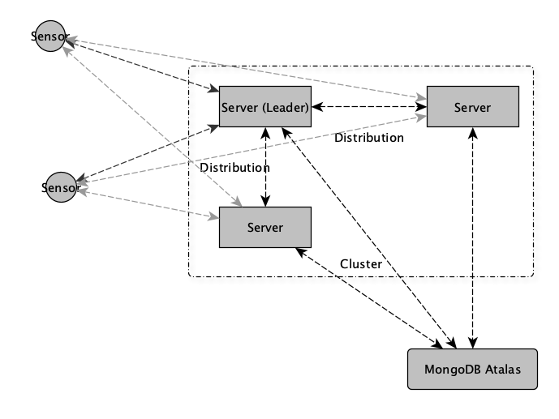

# Distributed Systems - Smart City 🏙️

Simple smart city server application and simulation of sensors for a distributed system using MongoDB Atalas as Database.

## Architecture

## API-Endpoints of the Database-Write-Application

Important from the outside:

- `/sensor/air_quality`

Internal use for the election process:

- `/bully/health`
- `/bully/election`

Note: the election algorithm is not implemented correctly. The eletion messages should only send to nodes with a higher ID and after a specific time the node with the highest ID sends a message to all, that he is the leader.

### Important Notes

- Send to the leader of the cluster, all else will return isLeader: false.
- The Leader is the Node with the highest ID.
- Can be found in the server/air-quality/cmd json config files.

### Test Nodes with CURL (here localhost:8080):

`curl -X POST -H "Content-Type: application/json" -d '{"sensor_id": "sensor123", "value": 25, "unit": "AQI"}' http://localhost:8080/sensor/air_quality
`

Returns either `{"isLeader":false}` or `{"isLeader":true}`
